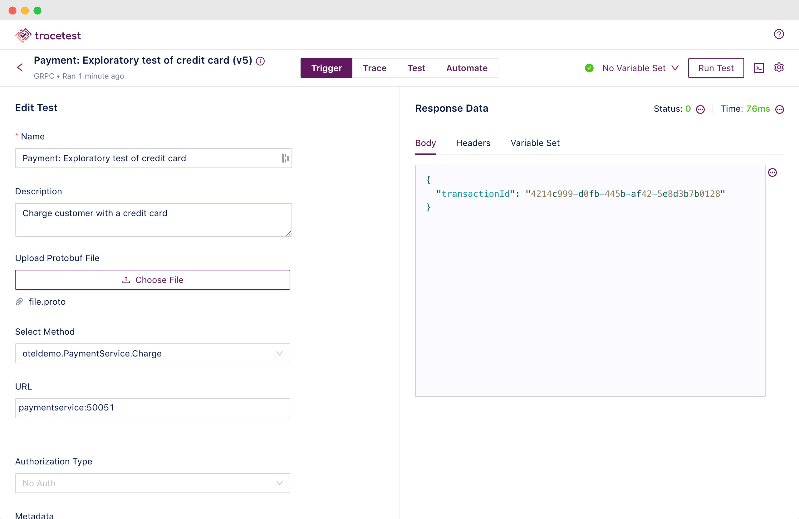
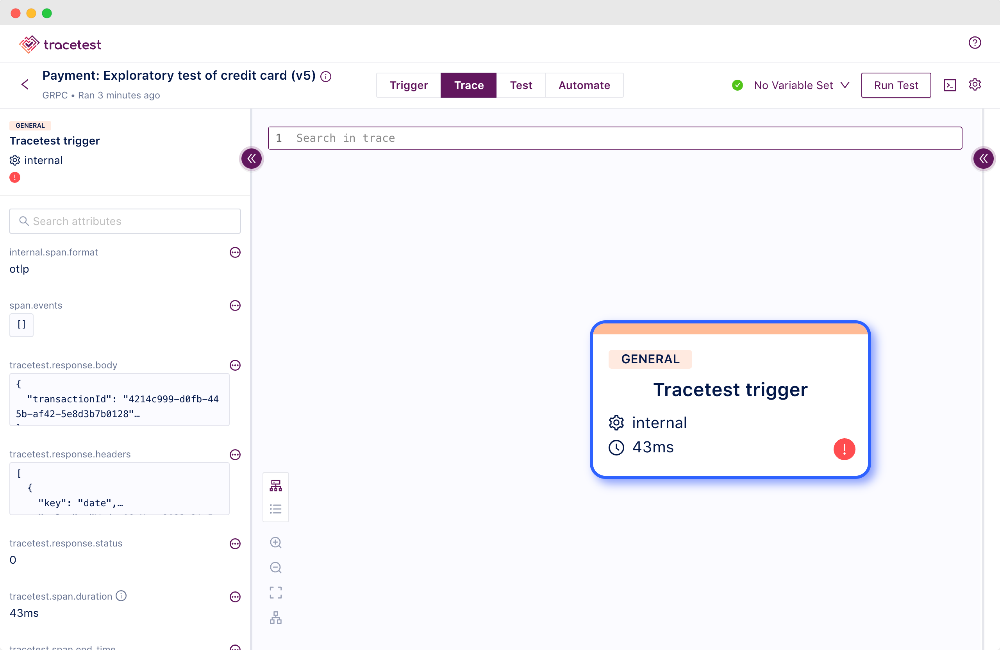
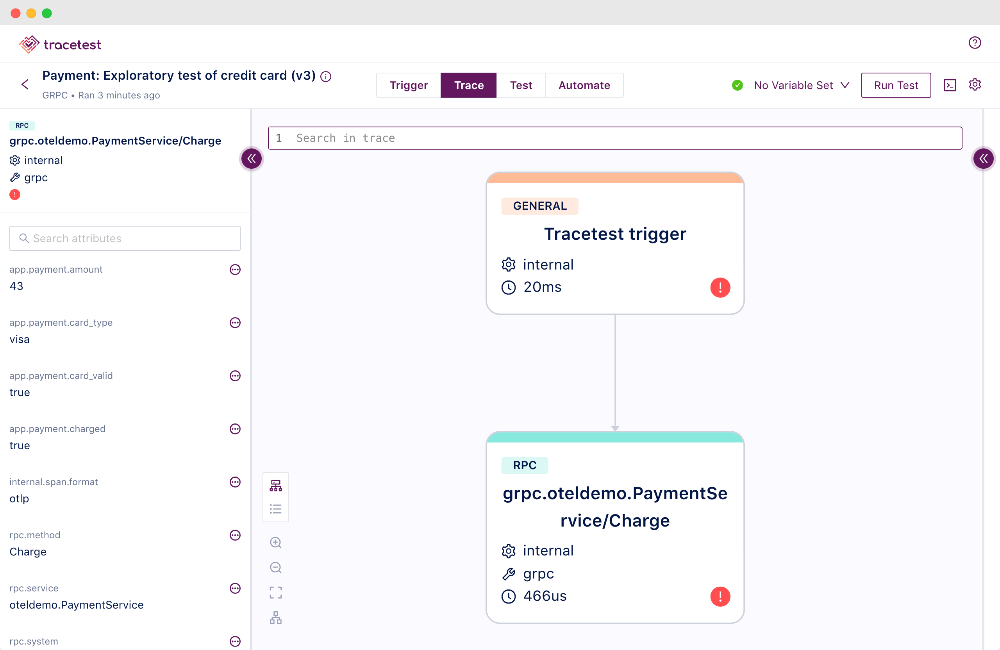
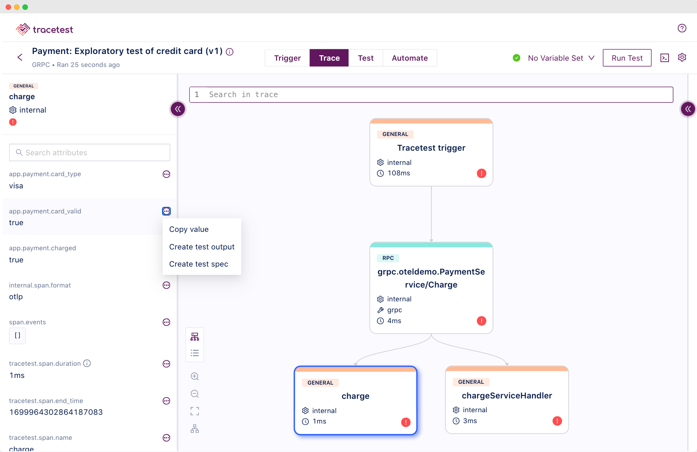
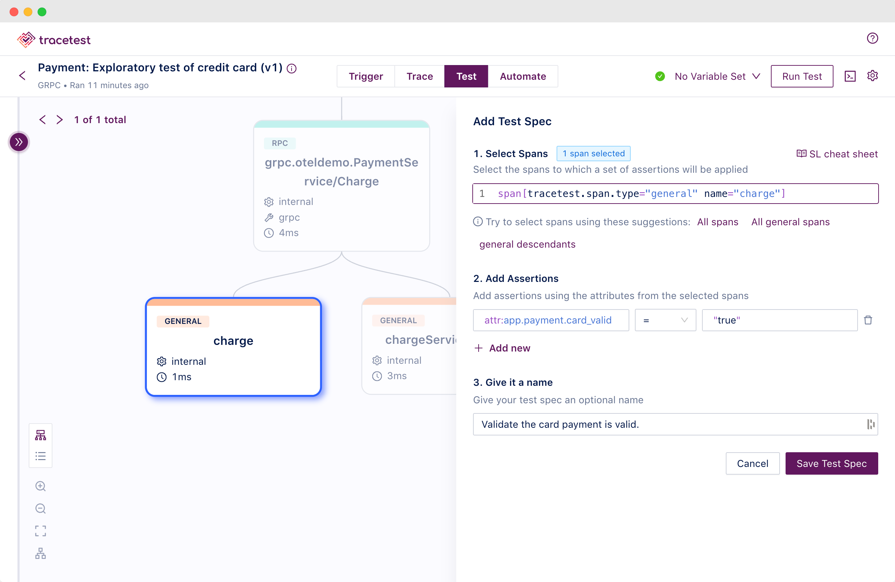
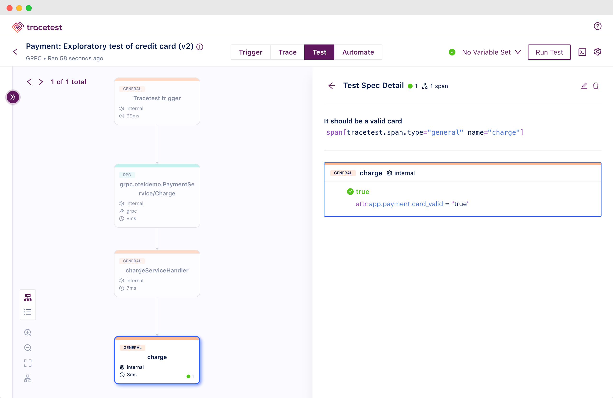

Today you’ll learn how to contribute to the OpenTelemetry Demo safely, by
learning to write OpenTelemetry code instrumentation and testing your
contributions by writing trace-based tests.

You can install and run the OpenTelemetry Demo in
Docker [with these commands](https://docs.tracetest.io/live-examples/opentelemetry-store/overview/#get-and-run-the-demo):

```bash
git clone https://github.com/open-telemetry/opentelemetry-demo.git
cd opentelemetry-demo/
make start
```

> _💡 Note: If you're running on Apple Silicon, run `make build` in order to
> create local images vs. pulling them from the repository._

Let’s start with the
[`docker-compose.yml`](https://github.com/kubeshop/opentelemetry-demo/blob/main/docker-compose.yml).
It contains four types of services.

- Core Demo Services
- Dependent Services
- Telemetry Components
- Tests

### Core Demo Services

These are the core services that make up the demo itself. The shopping cart, the
front end, ads, accounting, and much more. It’s the complete feature set of the
“Astronomy Shop” website!

### Dependent Services

These services are required and used by the Core Demo Services. They include
PostgreSQL, Kafka, and Redis.

### Telemetry Components

These services are solely focused on observability. Meaning, collecting,
storing, and visualizing telemetry data. They include Jaeger, Grafana,
OpenSearch, Prometheus, and OpenTelemetry Collector.

### Tests

The test services cover front-end, integration, and trace-based tests. Including
the Tracetest Server that runs the trace-based tests.

### Docker Compose Services Match the Architecture

Since the `docker-compose.yml` file is too large to embed in its entirety within
a web page,
[I’ve linked it here for you to check out](https://github.com/open-telemetry/opentelemetry-demo/blob/main/docker-compose.yml).

Looking at the `docker-compose.yml` you can also see the sections match the
architecture overview from above.

Another cool thing to note in the `docker-compose.yml` is the `tests` profile.

> Profiles (in Docker Compose) help you adjust the Compose application model for
> various uses and environments by selectively starting services. This is
> achieved by assigning each service to zero or more profiles. If unassigned,
> the service is always started but if assigned, it is only started if the
> profile is activated. _—
> [Docker Compose Website](https://docs.docker.com/compose/profiles/)_

This is convenient because you can start all services excluding the tests by
running this command.

```bash
docker compose up
```

But, if you want to include the tests, then adding a `--profile` flag will start
them as well.

```bash
docker compose --profile tests up
```

Finally, if you want to enable API observability-driven testing, you use another
profile called `odd`.

```bash
docker compose --profile odd up
```

### Use the Makefile

The `makefile` contains all the shorthand commands to build, run, and test the
OpenTelemetry Demo.

To start it, you run:

```bash
make start
```

Then you have more commands to stop it, build the images, and run tests.

```bash
make stop
make build
make run-tests
```

To run the trace-based tests alone, you can run this command.

```bash
make run-tracetesting
```

This command will start only the `traceBasedTests` Docker Compose service.
Essentially, it’ll run:

```bash
docker compose run traceBasedTests ${SERVICES_TO_TEST}
```

Where the `${SERVICES_TO_TEST}` is a parameter you can pass to define which
specific services to run tests against. In the `docker-compose.yml` you can see
exactly what Dockerfile the `traceBasedTests` service uses.

```yaml
# [...]
traceBasedTests:
  image: ${IMAGE_NAME}:${IMAGE_VERSION}-traceBasedTests
  container_name: traceBasedTests
  profiles:
    - tests
  build:
    context: ./
    dockerfile: ./test/tracetesting/Dockerfile
  # [...]
```

The `Dockerfile` in the `test/tracetesting` folder installs the
[Tracetest CLI](https://docs.tracetest.io/cli/cli-installation-reference) to run
tests, and executes a Bash file called
[`run.bash`](https://github.com/kubeshop/opentelemetry-demo/blob/main/test/tracetesting/run.bash).

```docker
# Dockerfile

# Copyright The OpenTelemetry Authors
# SPDX-License-Identifier: Apache-2.0

FROM alpine

WORKDIR /app

RUN apk --update add bash jq curl
RUN curl -L https://raw.githubusercontent.com/kubeshop/tracetest/main/install-cli.sh | bash -s -- ${TRACETEST_IMAGE_VERSION}

WORKDIR /app/test/tracetesting

ENTRYPOINT ["/bin/bash", "/app/test/tracetesting/run.bash"]
```

The `run.bash` file will dynamically either run tests against all services or
just the ones you pass as parameters. It will also generate an env file for
Tracetest to know how to reach the different services in order to test them. It
grabs the values from
[the `.env` file from the root](https://github.com/kubeshop/opentelemetry-demo/blob/main/.env)
of the repository.

With that, you’re ready to run your first tests. Start by only running the
`paymentservice` tests.

```bash
docker compose run traceBasedTests "payment-service"

# OR

make run-tracetesting SERVICES_TO_TEST="payment-service"
```

After a few minutes you’ll see this in your terminal.

```bash
make run-tracetesting SERVICES_TO_TEST="payment-service"

[ Output ]
docker compose run traceBasedTests payment-service
[+] Creating 21/0
 ✔ Container jaeger                   Running                                                                                                                            0.0s
 ✔ Container kafka                    Running                                                                                                                            0.0s
 ✔ Container tracetest-postgres       Running                                                                                                                            0.0s
 ✔ Container postgres                 Running                                                                                                                            0.0s
 ✔ Container redis-cart               Running                                                                                                                            0.0s
 ✔ Container feature-flag-service     Running                                                                                                                            0.0s
 ✔ Container otel-col                 Running                                                                                                                            0.0s
 ✔ Container currency-service         Running                                                                                                                            0.0s
 ✔ Container cart-service             Running                                                                                                                            0.0s
 ✔ Container payment-service          Running                                                                                                                            0.0s
 ✔ Container tracetest-server         Running                                                                                                                            0.0s
 ✔ Container quote-service            Running                                                                                                                            0.0s
 ✔ Container accounting-service       Running                                                                                                                            0.0s
 ✔ Container frauddetection-service   Running                                                                                                                            0.0s
 ✔ Container product-catalog-service  Running                                                                                                                            0.0s
 ✔ Container ad-service               Running                                                                                                                            0.0s
 ✔ Container email-service            Running                                                                                                                            0.0s
 ✔ Container recommendation-service   Running                                                                                                                            0.0s
 ✔ Container shipping-service         Running                                                                                                                            0.0s
 ✔ Container checkout-service         Running                                                                                                                            0.0s
 ✔ Container frontend                 Running                                                                                                                            0.0s
[+] Running 3/3
 ✔ Container postgres            Healthy                                                                                                                                 0.5s
 ✔ Container kafka               Healthy                                                                                                                                 0.5s
 ✔ Container tracetest-postgres  Healthy                                                                                                                                 0.5s
Starting tests...

Running trace-based tests...

✔ Payment Service (http://tracetest-server:11633/testsuite/payment-service-all/run/2)
	✔ Payment: valid credit card (http://tracetest-server:11633/test/payment-valid-credit-card/run/2/test) - trace id: 7774d4754957e5fa5b916e4d6d5880e7
		✔ It should call Charge method successfully
		✔ It should return a transaction ID
		✔ It should return a valid credit card
	✔ Payment: invalid credit card (http://tracetest-server:11633/test/payment-invalid-credit-card/run/2/test) - trace id: a20c1d166cd6edf4d8f288e407e76623
		✔ It should call Charge method and receive a gRPC error
		✔ It should return a return an gRPC error code to the caller
	✔ Payment: Amex credit card not allowed (http://tracetest-server:11633/test/payment-amex-credit-card-not-allowed/run/2/test) - trace id: a5812bf50ac61a387dc991ba0dd3020a
		✔ It should call Charge method and receive a gRPC error
		✔ It should return a return an gRPC error code to the caller
	✔ Payment: expired credit card (http://tracetest-server:11633/test/payment-expired-credit-card/run/2/test) - trace id: fecb6368104b0fc27e7806136fc1ab1c
		✔ It should call Charge method and receive a gRPC error
		✔ It should return a return an gRPC error code to the caller

Tests done! Exit code: 0
```

You can also start the Tracetest services alongside all the Core Demo Services,
Dependent Services, and Telemetry Components as part of your development
lifecycle to enable
[Observability-driven Development (ODD)](https://stackoverflow.blog/2022/10/12/how-observability-driven-development-creates-elite-performers/).
Mainly to trigger your APIs and validate both the response and trace data they
generate. You can also build tests visually and save them as YAML files to add
to your code repository for automated testing. I’ll walk you through all of this
a bit later as well.

To do this, you’ll use the `odd`
[Docker Compose profile](https://docs.docker.com/compose/profiles/). Run the
demo like this:

```bash
docker compose --profile odd up --force-recreate --remove-orphans --detach

# OR

make start-odd
```

Go ahead and start the OpenTelemetry Demo including Tracetest, with the `odd`
profile.

Once the images are built and containers are started you can access:

- Web store: [http://localhost:8080/](http://localhost:8080/)
- Grafana: [http://localhost:8080/grafana/](http://localhost:8080/grafana/)
- Feature Flags
  UI: [http://localhost:8080/feature/](http://localhost:8080/feature/)
- Load Generator
  UI: [http://localhost:8080/loadgen/](http://localhost:8080/loadgen/)
- Jaeger
  UI: [http://localhost:8080/jaeger/ui/](http://localhost:8080/jaeger/ui/)
- Tracetest UI: [http://localhost:11633/](http://localhost:11633/), only when
  using `make start-odd`

To run a test against the Payment Service, I’ll use a YAML file and trigger it
with the
[Tracetest CLI](https://docs.tracetest.io/getting-started/installation#install-the-tracetest-cli).
Alternatively, you can also build tests visually in the Tracetest UI
on [http://localhost:11633/](http://localhost:11633/).

> _Here’s a
> [short guide on how to create tests programatically](https://docs.tracetest.io/getting-started/open#creating-trace-based-tests-programatically)
> with Tracetest._

Next, let’s move on to explaining and adding code instrumentation in the
`paymentservice`.

### Adding OpenTelemetry to the Payment Service

I’ve prepared a fork with detailed code examples and three demos. This will help
you understand how to add OpenTelemetry code instrumentation.

```bash
git clone https://github.com/kubeshop/opentelemetry-demo.git
cd opentelemetry-demo/
make start-odd
```

Here’s a snippet of what configuring
[automatic instrumentation for Node.js looks like in the `src/paymentservice/opentelemetry.js` file](https://github.com/kubeshop/opentelemetry-demo/blob/main/src/paymentservice/opentelemetry.js).

```jsx
// src/paymentservice/opentelemetry.js

const opentelemetry = require('@opentelemetry/sdk-node');
const {
  getNodeAutoInstrumentations,
} = require('@opentelemetry/auto-instrumentations-node');
const {
  OTLPTraceExporter,
} = require('@opentelemetry/exporter-trace-otlp-grpc');
const {
  OTLPMetricExporter,
} = require('@opentelemetry/exporter-metrics-otlp-grpc');
const { PeriodicExportingMetricReader } = require('@opentelemetry/sdk-metrics');
const {
  alibabaCloudEcsDetector,
} = require('@opentelemetry/resource-detector-alibaba-cloud');
const {
  awsEc2Detector,
  awsEksDetector,
} = require('@opentelemetry/resource-detector-aws');
const {
  containerDetector,
} = require('@opentelemetry/resource-detector-container');
const { gcpDetector } = require('@opentelemetry/resource-detector-gcp');
const {
  envDetector,
  hostDetector,
  osDetector,
  processDetector,
} = require('@opentelemetry/resources');

const sdk = new opentelemetry.NodeSDK({
  // OTLPTraceExporter() uses the env var "OTEL_EXPORTER_OTLP_ENDPOINT" when not explicitly set.
  traceExporter: new OTLPTraceExporter(),
  instrumentations: [getNodeAutoInstrumentations()],
  metricReader: new PeriodicExportingMetricReader({
    exporter: new OTLPMetricExporter(),
  }),
  resourceDetectors: [
    containerDetector,
    envDetector,
    hostDetector,
    osDetector,
    processDetector,
    alibabaCloudEcsDetector,
    awsEksDetector,
    awsEc2Detector,
    gcpDetector,
  ],
});
sdk.start();
```

> _View automatic instrumentation samples for other programming languages,
> [here](../docs/instrumentation/)._

These few lines of code will automatically start generating trace spans for your
service.

The
[`paymentservice`](https://github.com/kubeshop/opentelemetry-demo/tree/main/src/paymentservice)
also includes manually instrumented spans as well. If you take a look at the
[`src/paymentservice/index.js`](https://github.com/kubeshop/opentelemetry-demo/blob/main/src/paymentservice/index.js)
and
[`src/paymentservice/charge.js`](https://github.com/kubeshop/opentelemetry-demo/blob/main/src/paymentservice/charge.js)
you’ll see a require statement for the `@opentelemetry/api`, and a tracer that
creates a span with some attributes.

```jsx
// src/paymentservice/index.js

// Line 6
const { trace, context, SpanStatusCode } = require('@opentelemetry/api');
const tracer = trace.getTracer('paymentservice');

// [...]

function chargeServiceHandler(call, callback) {
  // Line 23
  const span = trace.getActiveSpan();
  try {
    const amount = call.request.amount;

    span.setAttributes({
      'app.payment.amount': parseFloat(`${amount.units}.${amount.nanos}`),
    });
    span.addEvent('Charge request received.', {
      'log.severity': 'info',
      'log.message': 'Charge request received.',
      request: call.request,
    });

    const response = charge.charge(call.request);

    // [...]
  } catch (err) {
    // [...]
  }
}

// src/paymentservice/charge.js
// Line 4
const opentelemetry = require('@opentelemetry/api');
const { context, propagation, trace, metrics } = opentelemetry;
// [...]
// Line 10
const tracer = trace.getTracer('paymentservice');
// [...]
// Line 21
const span = trace.getActiveSpan();
// [...]
// Line 53
span.setAttributes({
  'app.payment.card_type': cardType,
  'app.payment.card_valid': valid,
});
// [...]
```

I’ll walk you through these three demos, with one sample without telemetry.

1. **Demo 0**: What’s it like without OpenTelemetry traces?
2. **Demo 1**: Get the active span from the context and use it as the main span
   in the `chargeServiceHandler` .
3. **Demo 2**: Get the active span from the context to create a new context.
   Create a new span for the `chargeServiceHandler` and pass the new context in
   as a parameter.
4. **Demo 3**: Create a new active span for the `chargeServiceHandler` without
   the need to pass a parent span and context.

But first, let’s make it harder! It’s easy to get started when somebody is
holding your hand. Let’s remove the guardrails for a second. Literally, let’s
remove the OpenTelemetry instrumentation and run some API tests to see what
happens.

### Removing OpenTelemetry and Running API Tests

Without the `opentelemetry.js` file that contains auto instrumentation,
triggering the `paymentservice/charge` API endpoint will result in no traces
showing up. Let’s reproduce this by running an API test with Tracetest. First,
I’ll comment out all the content in the `opentelemetry.js` file. Then, comment
out all the OpenTelemetry-specific code in the `index.js` and `charge.js`.

You’ll see a “**0. Demo**” comment section. If you need help figuring out what
code to exclude, it can be your guideline.

```jsx
// src/paymentservice/index.js

function chargeServiceHandler(call, callback) {
  /**
   * 0. Demo Start
   * 0. Demo: No telemetry
   */
  try {
    const response = charge.charge(call.request);
    callback(null, response);
  } catch (err) {
    callback(err);
  }
  /**
   * 0. Demo End
   */
}

// src/paymentservice/charge.js

// Comment out code below this block comment:
/**
 * 1. & 2. & 3. Demo
 * End the span.
 */
```

To run a test against the Payment Service, I’ll use a YAML file and trigger it
with the
[Tracetest CLI](https://docs.tracetest.io/getting-started/installation#install-the-tracetest-cli).

The test is located in the
[`test/tracetesting/payment-service`](https://github.com/kubeshop/opentelemetry-demo/blob/contrib-otel-demo/test/tracetesting/payment-service)
directory on the `contrib-otel-demo` branch. The directory has 5 files, but
you'll focus on the file called `exploratory-test.yaml`.

```yaml
# exploratory-test.yaml

type: Test
spec:
  id: payment-valid-credit-card
  name: 'Payment: Exploratory test of credit card'
  description: Charge customer with a credit card
  trigger:
    type: grpc
    grpc:
      protobufFile: ../../../../pb/demo.proto
      address: paymentservice:50051
      method: oteldemo.PaymentService.Charge
      request: |-
        {
          "amount": {
            "currencyCode": "USD",
            "units": 43,
            "nanos": 130000000
          },
          "creditCard": {
            "creditCardNumber": "4432-8015-6152-0454",
            "creditCardCvv": 672,
            "creditCardExpirationYear": 2039,
            "creditCardExpirationMonth": 1
          }
        }
```

As you see it’s a gRPC API and it’s using a
[protobuf file called `demo.proto`](https://github.com/kubeshop/opentelemetry-demo/blob/main/pb/demo.proto).
Here’s a snippet for the `Charge` method in the `demo.proto`.

```protobuf
// Line 179
service PaymentService {
    rpc Charge(ChargeRequest) returns (ChargeResponse) {}
}

message CreditCardInfo {
    string credit_card_number = 1;
    int32 credit_card_cvv = 2;
    int32 credit_card_expiration_year = 3;
    int32 credit_card_expiration_month = 4;
}

message ChargeRequest {
    Money amount = 1;
    CreditCardInfo credit_card = 2;
}

message ChargeResponse {
    string transaction_id = 1;
}
```

Triggering the test is as easy as running this command with the Tracetest CLI.

```bash
tracetest run test -f path-to-dir/exploratory-test.yaml
```



The test will return a response just fine, but the trace polling will timeout
since it won’t be able to find any traces.



It makes sense since you just disabled the OpenTelemetry code instrumentation.

### Learning About Active Spans and Context

Let me backtrack and add both the automatic and manual instrumentation back into
the `paymentservice`. Once I add them and trigger the `paymentservice/charge`
API endpoint, traces will be displayed and I’ll be able to create tests. It’s as
simple as that to get started!

As I mentioned above, I’ve prepared comments labeled **“1. Demo”** that showcase
which commented code to include. This demo shows how to use the active `rpc`
span from the injected gRPC instrumentation as the main span in the
`chargeServiceHandler` . All our additional manual telemetry will be added to
that span.

Open up the
[`src/paymentservice/index.js`](https://github.com/kubeshop/opentelemetry-demo/blob/main/src/paymentservice/index.js)
and
[`src/paymentservice/charge.js`](https://github.com/kubeshop/opentelemetry-demo/blob/main/src/paymentservice/charge.js)
once again.

Make sure to include these lines:

```jsx
// src/paymentservice/index.js

// [...]
const { trace, context, SpanStatusCode } = require('@opentelemetry/api');
// [...]
function chargeServiceHandler(call, callback) {
  const span = trace.getActiveSpan();
  try {
    const amount = call.request.amount;

    /**
     * Add span attributes and events for custom test specs
     */
    span.setAttributes({
      'app.payment.amount': parseFloat(`${amount.units}.${amount.nanos}`),
    });
    span.addEvent('Charge request received.', {
      'log.severity': 'info',
      'log.message': 'Charge request received.',
      request: call.request,
    });

    const response = charge.charge(call.request);

    /**
     * Add span attributes and events for custom test specs
     */
    span.setStatus({ code: SpanStatusCode.OK });
    span.end();

    callback(null, response);
  } catch (err) {
    /**
     * Add span attributes and events for custom test specs
     */
    span.addEvent('Charge request error.', {
      'log.severity': 'warn',
      'log.message': 'Charge request error.',
      error: err,
    });
    span.recordException(err);
    span.setStatus({ code: SpanStatusCode.ERROR });
    span.end();

    callback(err);
  }
}

// src/paymentservice/charge.js

const opentelemetry = require('@opentelemetry/api');
const { context, propagation, trace, metrics } = opentelemetry;
// [...]
module.exports.charge = (request) => {
  const span = trace.getActiveSpan();

  const {
    creditCardNumber: number,
    creditCardExpirationYear: year,
    creditCardExpirationMonth: month,
  } = request.creditCard;
  const currentMonth = new Date().getMonth() + 1;
  const currentYear = new Date().getFullYear();
  const lastFourDigits = number.substr(-4);
  const transactionId = uuidv4();

  const card = cardValidator(number);
  const { card_type: cardType, valid } = card.getCardDetails();

  span.setAttributes({
    'app.payment.card_type': cardType,
    'app.payment.card_valid': valid,
  });

  if (!valid) {
    throw new Error('Credit card info is invalid.');
  }

  if (!['visa', 'mastercard'].includes(cardType)) {
    throw new Error(
      `Sorry, we cannot process ${cardType} credit cards. Only VISA or MasterCard is accepted.`,
    );
  }

  if (currentYear * 12 + currentMonth > year * 12 + month) {
    throw new Error(
      `The credit card (ending ${lastFourDigits}) expired on ${month}/${year}.`,
    );
  }

  const baggage = propagation.getBaggage(context.active());
  if (
    baggage &&
    baggage.getEntry('synthetic_request') &&
    baggage.getEntry('synthetic_request').value === 'true'
  ) {
    span.setAttribute('app.payment.charged', false);
  } else {
    span.setAttribute('app.payment.charged', true);
  }

  span.end();

  const { units, nanos, currencyCode } = request.amount;
  // [...]
  transactionsCounter.add(1, { 'app.payment.currency': currencyCode });
  return { transactionId };
};
```

Running the test again will show the `rpc` span correctly.

```bash
tracetest run test -f path-to-dir/exploratory-test.yaml
```



However, you’re still not there yet! I want you to understand how to create a
child span below the `rpc` span. The child span will be dedicated too the
`charge.js` file and make it easier to view span attributes separately instead
of bundling all of them onto one span.

### Learning to Add a Child Span

Let’s go back to the
[`src/paymentservice/index.js`](https://github.com/kubeshop/opentelemetry-demo/blob/main/src/paymentservice/index.js)
and
[`src/paymentservice/charge.js`](https://github.com/kubeshop/opentelemetry-demo/blob/main/src/paymentservice/charge.js).

Edit the files to use the “**2. Demo**”. You only need to change the particular
lines I’ll show below. The rest of the file can stay the same.

```jsx
// src/paymentservice/index.js

// [...]
function chargeServiceHandler(call, callback) {
  // [...]
  const parent = trace.getActiveSpan();
  const ctx = trace.setSpan(context.active(), parent);
  const span = tracer.startSpan('chargeServiceHandler', undefined, ctx);
  // [...]
}

// src/paymentservice/charge.js

module.exports.charge = (request) => {
  // [...]
  const parent = trace.getActiveSpan();
  const ctx = trace.setSpan(context.active(), parent);
  const span = tracer.startSpan('charge', undefined, ctx);
  // [...]
};
```

What happens now?

With this custom instrumentation added to the Payment Service’s `index.js` and
`charge.js` files, you’ll add two child spans to the `rpc` parent span.

Trigger the exploratory trace-based test once again to see what it looks like.

```bash
tracetest run test -f path-to-dir/exploratory-test.yaml
```



Now, add an assertion to validate the card is valid. You do this by selecting
the `app.payment.card_valid` span and clicking “Create test spec”, and
proceeding to add it visually.



Or, add the assertion programatically to the test definition YAML file.

```yaml
specs:
  - name: It should be a valid card
    selector: span[tracetest.span.type="general" name="charge"]
    assertions:
      - attr:app.payment.card_valid = "true"
```

See
[this file](https://github.com/kubeshop/opentelemetry-demo/blob/main/test/tracetesting/payment-service/valid-credit-card.yaml)
for reference.

### Adding an Active Span and a Child Span

Taking it a step further, let me walk you through adding an active span and
attaching the `charge` span as a child span onto it. This will clean up your
distributed trace and create a nice hierarchy.

Let’s go back to the
[`src/paymentservice/index.js`](https://github.com/kubeshop/opentelemetry-demo/blob/main/src/paymentservice/index.js)
and
[`src/paymentservice/charge.js`](https://github.com/kubeshop/opentelemetry-demo/blob/main/src/paymentservice/charge.js)
one last time.

Edit the files to use the “**3. Demo**”. You only need to change the particular
lines I’ll show below. The rest of the file can stay the same.

```jsx
// src/paymentservice/index.js

// [...]
function chargeServiceHandler(call, callback) {
  // [...]
  return tracer.startActiveSpan('chargeServiceHandler', (span) => {
    try {
      const amount = call.request.amount;

      span.setAttributes({
        'app.payment.amount': parseFloat(`${amount.units}.${amount.nanos}`),
      });
      span.addEvent('Charge request received.', {
        'log.severity': 'info',
        'log.message': 'Charge request received.',
        request: call.request,
      });

      const response = charge.charge(call.request);

      span.setStatus({ code: SpanStatusCode.OK });
      span.end();

      callback(null, response);
    } catch (err) {
      span.addEvent('Charge request error.', {
        'log.severity': 'warn',
        'log.message': 'Charge request error.',
        error: err,
      });
      span.recordException(err);
      span.setStatus({ code: SpanStatusCode.ERROR });
      span.end();

      callback(err);
    }
  });
  // [...]
}

// src/paymentservice/charge.js

module.exports.charge = (request) => {
  // [...]
  const span = tracer.startSpan('charge');
  // [...]
};
```

There are two main things to remember and take away from this third demo.

- The `startActiveSpan()` method returns a Promise.
- Every `span` created with the `startSpan()` method within the
  `startActiveSpan()` method will be added to the active span as a child span.

Trigger the exploratory trace-based test once again to see what it looks like.
But, now you’ve included the test spec. You’ll get a test summary in the CLI and
it will also be reflected in the Web UI.

```bash
tracetest run test -f path-to-dir/exploratory-test.yaml

[Output]
✔ Payment: Exploratory test of credit card (http://localhost:11633/test/payment-valid-credit-card/run/2/test) - trace id: f6d754f3f87ba5cc9da5075037ba266a
	✔ It should be a valid card
```



Awesome work! With the code instrumentation configured correctly, you can move
on to adding tests to cover all the edge cases of the `paymentservice`.

## Creating Trace-based Tests for the Payment Service

The 4 cases I would like you to cover are:

1. Test if a credit card is valid
2. Test if a credit card is invalid
3. Test if a credit card has expired
4. Test if a credit card is not allowed

Let’s jump in.

### Test if a Credit Card is Valid

To test the validity of a credit card you’ll add three assertions.

```yaml
# [...]
specs:
  - name: It should call Charge method successfully
    selector:
      span[tracetest.span.type="rpc" name="grpc.oteldemo.PaymentService/Charge"
      rpc.system="grpc" rpc.method="Charge"
      rpc.service="oteldemo.PaymentService"]
    # instead of returning status_code 0, this service can return 1 depending on timing, but it works as intended
    assertions:
      # updating assertion to match 0 and 1
      - attr:rpc.grpc.status_code <= 1
  - name: It should return a transaction ID
    selector: span[tracetest.span.type="general" name="Tracetest trigger"]
    assertions:
      - attr:tracetest.response.body | json_path '$.transactionId' != ""
  - name: It should return a valid credit card
    selector: span[tracetest.span.type="general" name="charge"]
    assertions:
      - attr:app.payment.card_valid = "true"
```

Since it’s a gRPC API you’ll assert on status code, the response, and finally
the span attribute validating the credit card.
[View the full test YAML here](https://github.com/kubeshop/opentelemetry-demo/blob/main/test/tracetesting/payment-service/valid-credit-card.yaml).

### Test if a Credit Card is Invalid

To test if a credit card is invalid you’ll add two assertions.
[The `charge.js` file has a validity check](https://github.com/kubeshop/opentelemetry-demo/blob/e135e81702e096ae511625a2c414e29401080633/src/paymentservice/charge.js#L59)
that throws an error with the `"Credit card info is invalid."` message.

```jsx
// charge.js

if (!valid) {
  throw new Error('Credit card info is invalid.');
}
```

The first assertion will look to validate that error message. The second
assertion will check for the response status error code.

```yaml
# [...]
specs:
  - name: It should call Charge method and receive a gRPC error
    selector:
      span[tracetest.span.type="rpc" name="grpc.oteldemo.PaymentService/Charge"
      rpc.system="grpc" rpc.method="Charge"
      rpc.service="oteldemo.PaymentService"]
    assertions:
      - attr:grpc.error_message = "Credit card info is invalid."
  - name: It should return a return an gRPC error code to the caller
    selector: span[tracetest.span.type="general" name="Tracetest trigger"]
    assertions:
      - attr:tracetest.response.status = 2
```

[View the full test YAML here.](https://github.com/kubeshop/opentelemetry-demo/blob/main/test/tracetesting/payment-service/invalid-credit-card.yaml)

### Test if a Credit Card has Expired

To test if a credit card has expired you’ll add two assertions.
[Just like the invalid error, the `charge.js` file has an expiration check](https://github.com/kubeshop/opentelemetry-demo/blob/e135e81702e096ae511625a2c414e29401080633/src/paymentservice/charge.js#L59)
that throws an error with the
`"The credit card (ending ${lastFourDigits}) expired on ${month}/${year}."`
message.

```jsx
// charge.js

if (currentYear * 12 + currentMonth > year * 12 + month) {
  throw new Error(
    `The credit card (ending ${lastFourDigits}) expired on ${month}/${year}.`,
  );
}
```

The first assertion will look to validate that error message. The second
assertion will check for the response status error code.

```yaml
# [...]
specs:
  - name: It should call Charge method and receive a gRPC error
    selector:
      span[tracetest.span.type="rpc" name="grpc.oteldemo.PaymentService/Charge"
      rpc.system="grpc" rpc.method="Charge"
      rpc.service="oteldemo.PaymentService"]
    assertions:
      - attr:grpc.error_message = "The credit card (ending 0454) expired on
        1/2021."
  - name: It should return a return an gRPC error code to the caller
    selector: span[tracetest.span.type="general" name="Tracetest trigger"]
    assertions:
      - attr:tracetest.response.status = 2
```

[View the full test YAML here.](https://github.com/kubeshop/opentelemetry-demo/blob/main/test/tracetesting/payment-service/expired-credit-card.yaml)

### Test if a Credit Card is Not Allowed

[The `charge.js` has a validity check to make sure only Visa and Mastercard credit cards are allowed](https://github.com/kubeshop/opentelemetry-demo/blob/e135e81702e096ae511625a2c414e29401080633/src/paymentservice/charge.js#L62-L64).
It will throw an error the message
`"Sorry, we cannot process ${cardType} credit cards. Only VISA or MasterCard is accepted."`.

```jsx
if (!['visa', 'mastercard'].includes(cardType)) {
  throw new Error(
    `Sorry, we cannot process ${cardType} credit cards. Only VISA or MasterCard is accepted.`,
  );
}
```

The first assertion will look to validate that error message. The second
assertion will check for the response status error code.

```yaml
specs:
  - name: It should call Charge method and receive a gRPC error
    selector:
      span[tracetest.span.type="rpc" name="grpc.oteldemo.PaymentService/Charge"
      rpc.system="grpc" rpc.method="Charge"
      rpc.service="oteldemo.PaymentService"]
    assertions:
      - attr:grpc.error_message = "Sorry, we cannot process amex credit cards.
        Only VISA or MasterCard is accepted."
  - name: It should return a return an gRPC error code to the caller
    selector: span[tracetest.span.type="general" name="Tracetest trigger"]
    assertions:
      - attr:tracetest.response.status = 2
```

[View the full test YAML here.](https://github.com/kubeshop/opentelemetry-demo/blob/main/test/tracetesting/payment-service/amex-credit-card-not-allowed.yaml)

## What you learned about contributing to OpenTelemetry

Today you learned three main things.

1. How to demystify OpenTelemetry by adding automatic and manual code
   instrumentation.
2. How to use trace-based testing in the OpenTelemetry Demo to maintain feature
   functionality and telemetry integrity.
3. How to contribute to the OpenTelemetry Demo safely while avoiding
   regressions.

Now you can clearly understand OpenTelemetry, writing code instrumentation, and
incorporating traces into trace-based tests. You're better prepared to
contribute meaningful additions to the OpenTelemetry project and validate your
contributions with trace-based testing.
